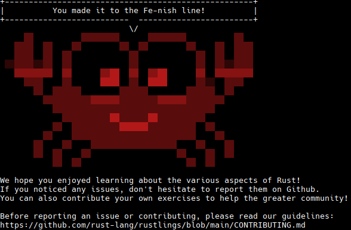

# Rustlings

--
# Rustlings Learning Journey 🦀

This repository contains my solutions and progress through the [Rustlings](https://github.com/rust-lang/rustlings) exercises - a collection of small exercises designed to help developers learn Rust programming language concepts through hands-on practice.

## 📚 What is Rustlings?

Rustlings is an interactive learning tool that teaches Rust through small, focused exercises. Each exercise is designed to teach a specific concept or feature of the Rust programming language. The exercises start simple and gradually increase in complexity, covering everything from basic syntax to advanced concepts like lifetimes and smart pointers.

## 🎯 Learning Progress

I've completed all **95 exercises** across **23 different topics**:

### Core Concepts
- **Variables & Mutability** - Understanding Rust's ownership model basics
- **Functions** - Function definitions, parameters, and return types
- **Control Flow** - If expressions and pattern matching
- **Data Types** - Primitive types, arrays, tuples, and slices

### Intermediate Topics
- **Collections** - Working with vectors and hash maps
- **Ownership & Borrowing** - Move semantics and reference handling
- **Structs & Enums** - Custom data types and pattern matching
- **String Handling** - String vs &str and text manipulation
- **Modules** - Code organization and visibility

### Advanced Concepts
- **Error Handling** - Result types and proper error propagation
- **Generics & Traits** - Type parameterization and shared behavior
- **Lifetimes** - Memory safety guarantees and reference validation
- **Iterators** - Functional programming patterns in Rust
- **Smart Pointers** - Box, Rc, Arc, and Cow for memory management
- **Concurrency** - Thread safety and message passing
- **Macros** - Code generation and metaprogramming

### Best Practices
- **Testing** - Writing unit tests and test-driven development
- **Clippy** - Using Rust's linter for code quality
- **Type Conversions** - Safe casting and trait implementations

## 🚀 Key Learning Outcomes

Through these exercises, I've gained:

1. **Memory Safety Mastery**: Deep understanding of Rust's ownership system, borrowing rules, and how they prevent common bugs like null pointer dereferences and memory leaks.

2. **Functional Programming Skills**: Proficiency with iterators, closures, and functional programming patterns that make Rust code expressive and efficient.

3. **Concurrent Programming**: Understanding of Rust's approach to thread safety through types like `Arc`, `Mutex`, and message passing with channels.

4. **Type System Expertise**: Ability to leverage Rust's powerful type system with generics, traits, and lifetimes to write safe and reusable code.

5. **Error Handling Patterns**: Mastery of Rust's `Result` and `Option` types for robust error handling without exceptions.

## 🎉 Completion Status

**Status**: ✅ **COMPLETED** - All 95 exercises solved!

Each exercise has taught me something new about Rust's unique approach to systems programming, combining performance with safety in ways that other languages struggle to achieve.

## 💡 Next Steps

Having completed Rustlings, I'm now ready to:
- Build real-world Rust applications
- Contribute to open-source Rust projects
- Explore advanced topics like async programming and unsafe Rust
- Apply Rust's principles to systems programming challenges

---

*This repository represents my journey from Rust beginner to having a solid foundation in the language. The progression through these exercises has given me confidence to tackle more complex Rust projects and understand why Rust is becoming the language of choice for systems programming.*
